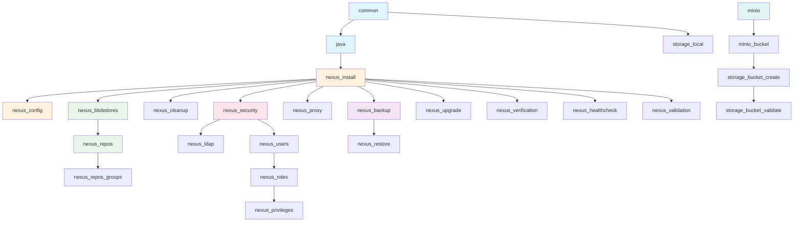
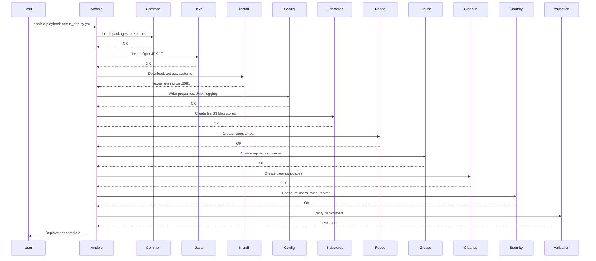
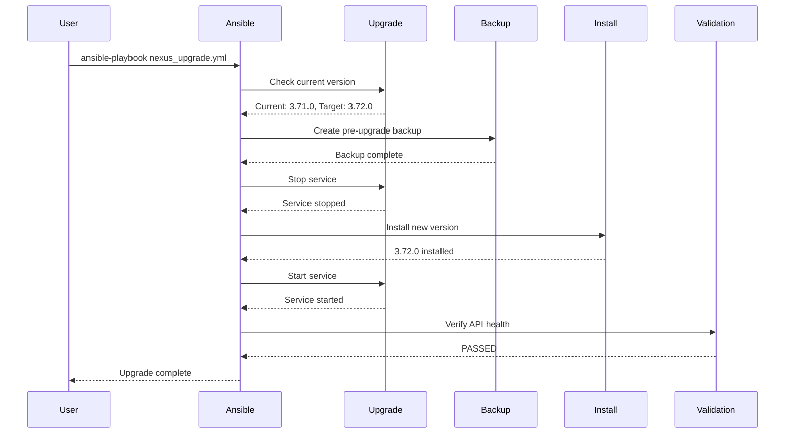
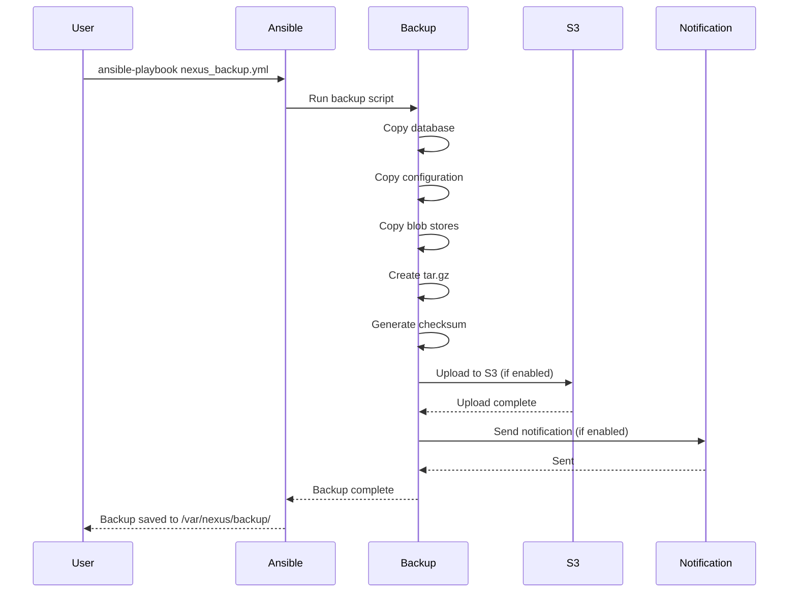
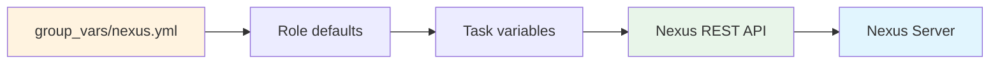
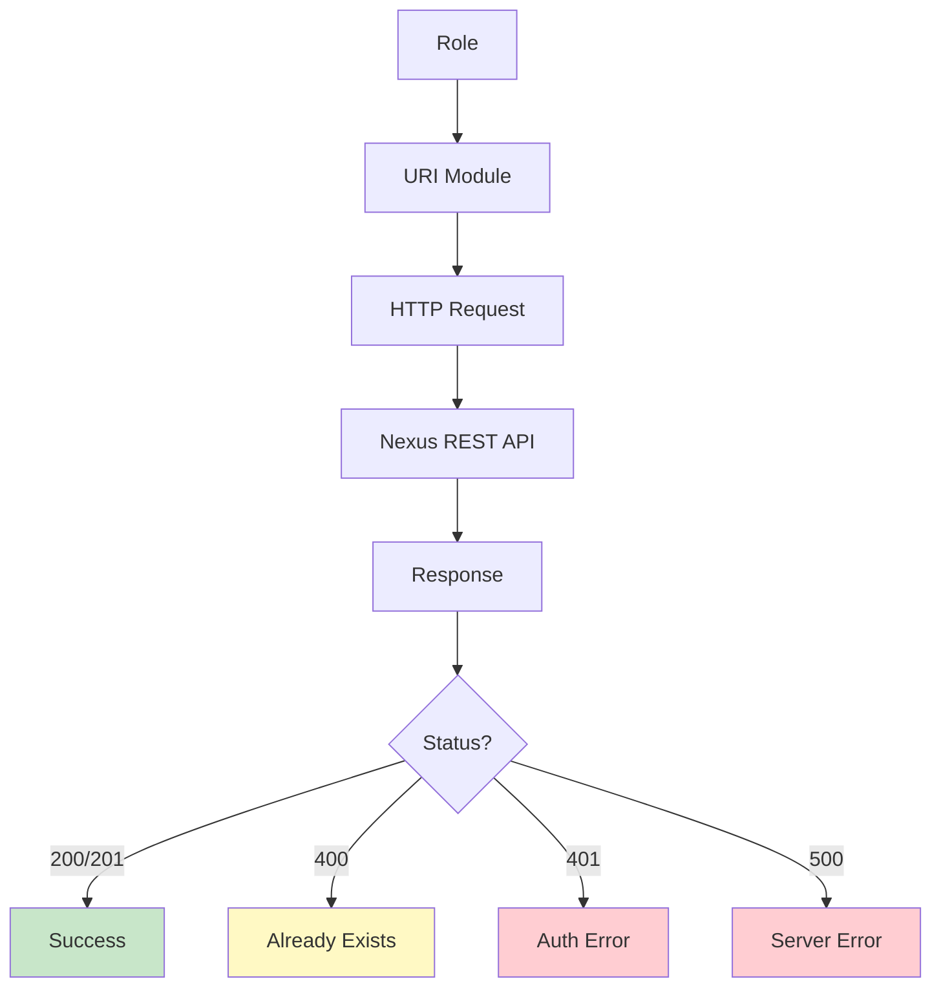
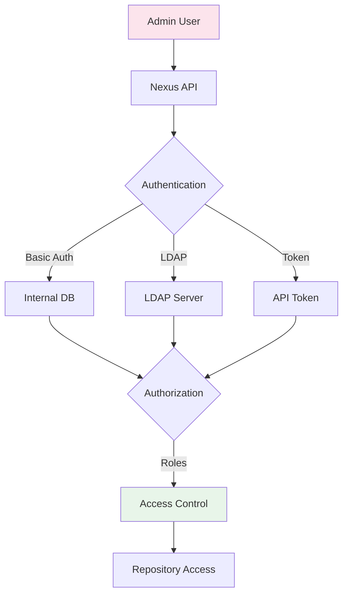
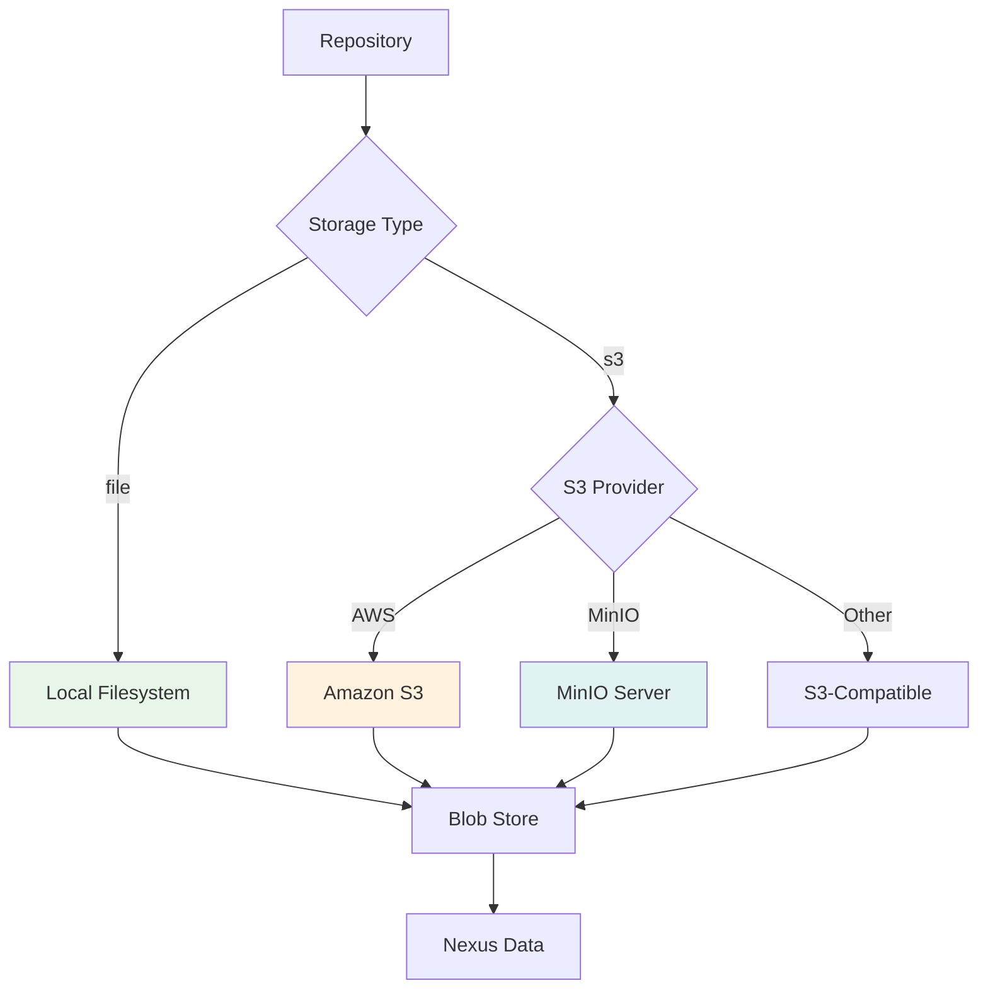

# Architecture

## Overview

This project follows the [Kubespray](https://github.com/kubernetes-sigs/kubespray) architecture pattern for Ansible projects. Every component is isolated into its own role, fully data-driven, and configurable from a single inventory file.

## Directory Structure

```
nexus-as-code/
├── ansible.cfg                    # Ansible configuration
├── galaxy.yml                     # Galaxy metadata
├── requirements.yml               # External dependencies
├── .gitignore
├── .yamllint
│
├── group_vars/
│   └── all/
│       └── nexus.yml              # MASTER CONFIGURATION
│
├── inventories/
│   ├── production/
│   │   ├── inventory.yml
│   │   └── group_vars/
│   │       └── nexus.yml          # Environment overrides
│   ├── staging/
│   └── testing/
│
├── roles/                         # 30+ independent roles
│   ├── common/                    # OS prerequisites
│   ├── java/                      # OpenJDK installation
│   ├── nexus_install/             # Nexus installation
│   ├── nexus_config/              # Runtime configuration
│   ├── storage/                   # Storage orchestrator
│   ├── storage_local/             # Local filesystem
│   ├── storage_minio/             # MinIO server
│   ├── storage_s3/                # S3 backend
│   ├── storage_bucket_create/     # Bucket creation
│   ├── storage_bucket_validate/   # Bucket validation
│   ├── nexus_blobstores/          # Blob store management
│   ├── nexus_repos/               # Repository management
│   ├── nexus_repos_groups/        # Repository groups
│   ├── nexus_cleanup/             # Cleanup policies
│   ├── nexus_security/            # Security core
│   ├── nexus_ldap/                # LDAP integration
│   ├── nexus_users/               # User management
│   ├── nexus_roles/               # Role management
│   ├── nexus_privileges/          # Privilege validation
│   ├── nexus_proxy/               # Outbound proxy
│   ├── nexus_backup/              # Backup
│   ├── nexus_restore/             # Restore
│   ├── nexus_upgrade/             # Upgrade
│   ├── nexus_destroy/             # Destruction
│   ├── nexus_healthcheck/         # Health checks
│   ├── nexus_verification/        # Configuration verification
│   └── nexus_validation/          # Pre-flight validation
│
├── playbooks/                     # Orchestration playbooks
├── plugins/                       # Custom modules/filters
├── files/scripts/                 # Helper scripts
└── tests/                         # Molecule tests
```

## Design Principles

### 1. Single Source of Truth

The **only** file users edit is:

```
inventories/<env>/group_vars/nexus.yml
```

All Ansible code reads from this file. No hardcoded values in roles.

### 2. Role Independence

Each role:
- Has its own `defaults/main.yml`
- Reads only from inventory variables
- Can be run independently
- Has no circular dependencies

### 3. Idempotency

Every task is idempotent — running the same playbook multiple times produces the same result without side effects.

### 4. Data-Driven Configuration

```yaml
# Everything is a list or dict — add a repo = add an entry
nexus_repos:
  - name: my-repo
    format: maven2
    type: hosted
```

### 5. Layered Precedence

```
host_vars/<host>.yml           (highest)
  ↓
inventories/<env>/group_vars/nexus.yml
  ↓
group_vars/all/nexus.yml
  ↓
roles/*/defaults/main.yml      (lowest)
```

## Role Dependency Graph



## Execution Flow

### Full Deployment



### Upgrade Flow



### Backup Flow



## Data Flow



## API Flow



## Security Model



## Storage Architecture


