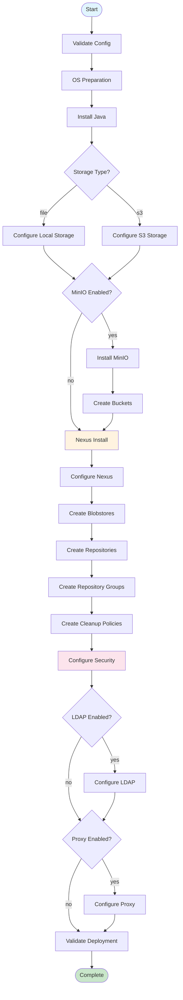
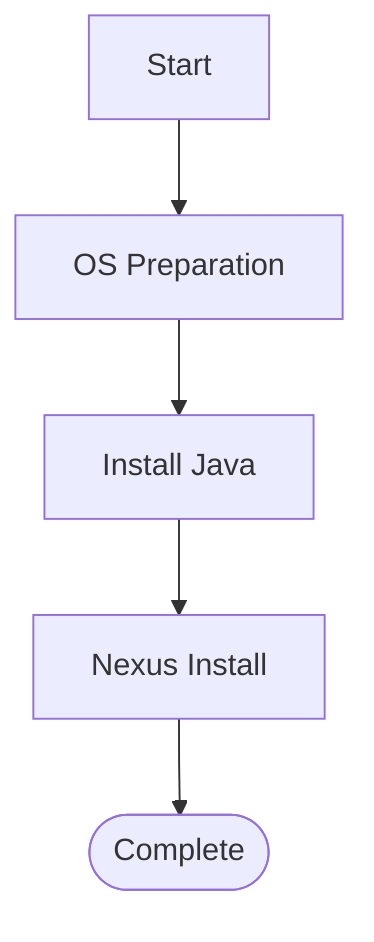
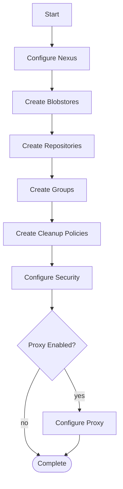
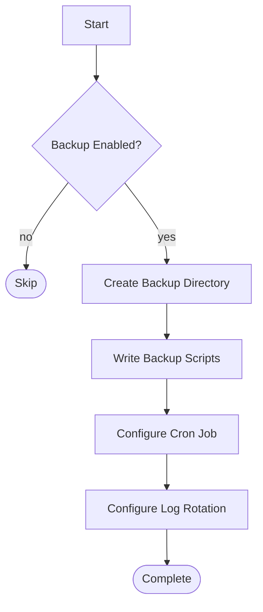
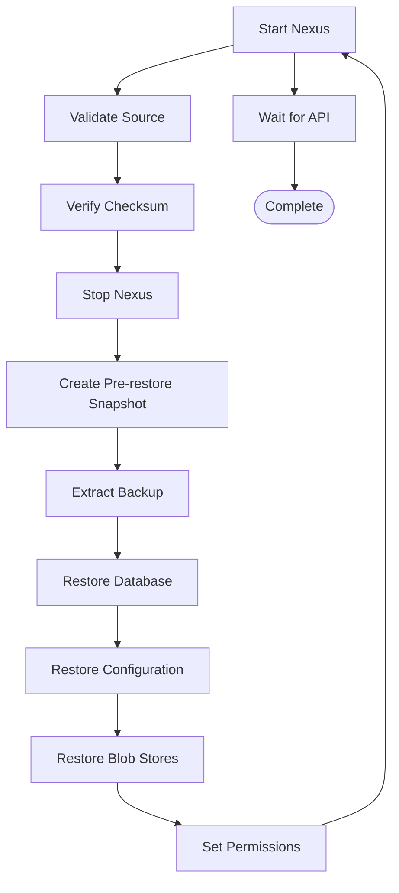
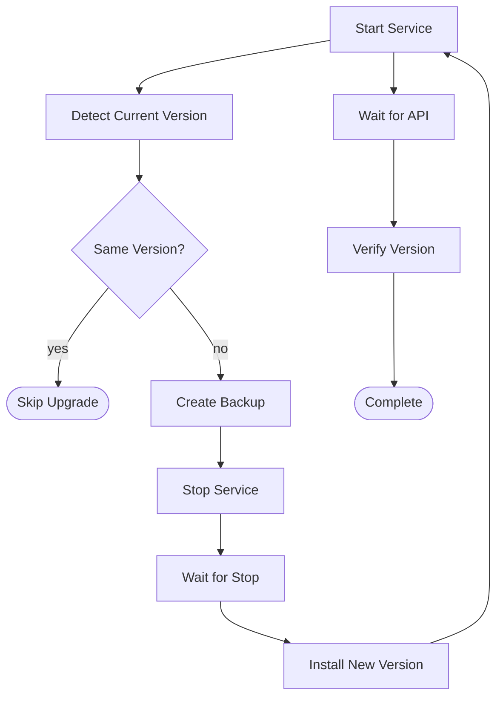
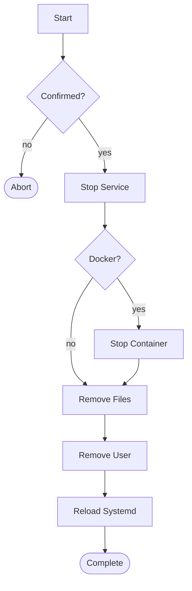
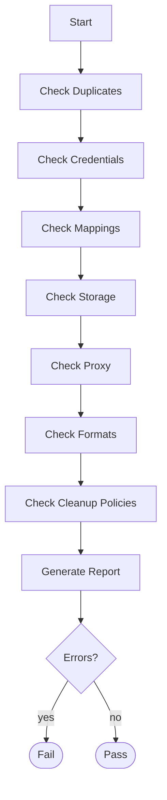

# Execution Flow

## Overview

This document describes the execution flow for each playbook.

## Full Deployment (`nexus_deploy.yml`)

### Task Sequence

| Step | Role | Tasks | Duration |
|---|---|---|---|
| 1 | common | Install packages, create user, dirs, sysctl | ~30s |
| 2 | java | Install OpenJDK 17 | ~60s |
| 3 | storage | Configure storage backend | ~5s |
| 4 | minio | Install MinIO (if enabled) | ~60s |
| 5 | storage_bucket_create | Create buckets (if enabled) | ~10s |
| 6 | nexus_install | Download, extract, systemd, start | ~120s |
| 7 | nexus_config | Write properties, JVM, logging | ~10s |
| 8 | nexus_blobstores | Create blob stores | ~15s |
| 9 | nexus_repos | Create repositories | ~30s |
| 10 | nexus_repos_groups | Create groups | ~10s |
| 11 | nexus_cleanup | Create cleanup policies | ~10s |
| 12 | nexus_security | Configure users, roles, realms | ~15s |
| 13 | nexus_ldap | Configure LDAP (if enabled) | ~10s |
| 14 | nexus_proxy | Configure proxy (if enabled) | ~5s |
| 15 | nexus_verification | Verify deployment | ~20s |
| **Total** | | | **~5-10 min** |

## Install Only (`nexus_install.yml`)

## Configure Only (`nexus_configure.yml`)

## Backup (`nexus_backup.yml`)

## Restore (`nexus_restore.yml`)

## Upgrade (`nexus_upgrade.yml`)

## Destroy (`nexus_destroy.yml`)

## Validation (`nexus_validate.yml`)

