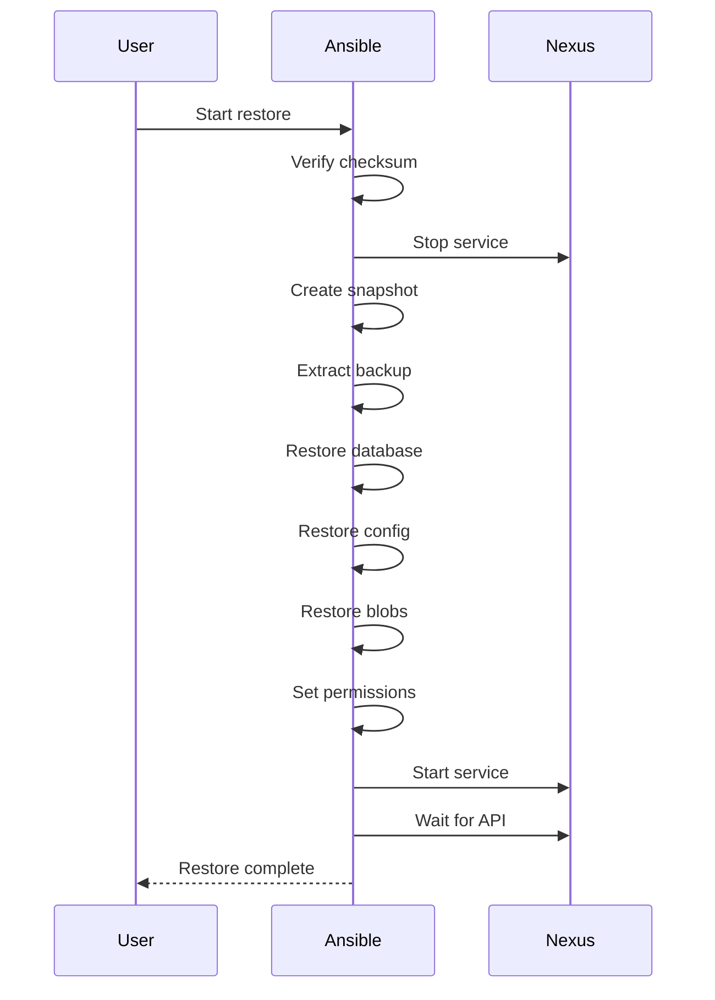

# Restore Guide

## Overview

Restore Nexus from a backup archive. The restore process:
1. Validates backup integrity
2. Stops Nexus service
3. Creates pre-restore snapshot
4. Extracts and restores data
5. Starts Nexus service
6. Verifies health

## Configuration

```yaml
nexus_restore_source: /var/nexus/backup/nexus-backup-20240115_020000.tar.gz
nexus_restore_validate: true
nexus_restore_pre_snapshot: true
nexus_restore_post_check: true
```

## Running Restore

```bash
# Via playbook
ansible-playbook -i inventories/production/inventory.yml playbooks/nexus_restore.yml

# With specific backup file
ansible-playbook -i inventories/production/inventory.yml playbooks/nexus_restore.yml \
  -e "nexus_restore_source=/var/nexus/backup/nexus-backup-20240115_020000.tar.gz"

# Via script (on the server)
/usr/local/bin/nexus-restore.sh /var/nexus/backup/nexus-backup-20240115_020000.tar.gz
```

## Restore Process



## Pre-Restore Snapshot

Before overwriting data, a snapshot is created:

```
/var/nexus/backup/pre-restore-20240115_120000/
└── etc/
    └── ... (configuration files)
```

## Rollback

If restore fails, use the pre-restore snapshot:

```bash
# Manually restore from snapshot
cp -a /var/nexus/backup/pre-restore-20240115_120000/etc/* /var/nexus/data/etc/
systemctl restart nexus
```

## Cross-Version Restore

Restoring from a backup created with a different Nexus version may require database migration. Nexus handles this automatically on startup.
