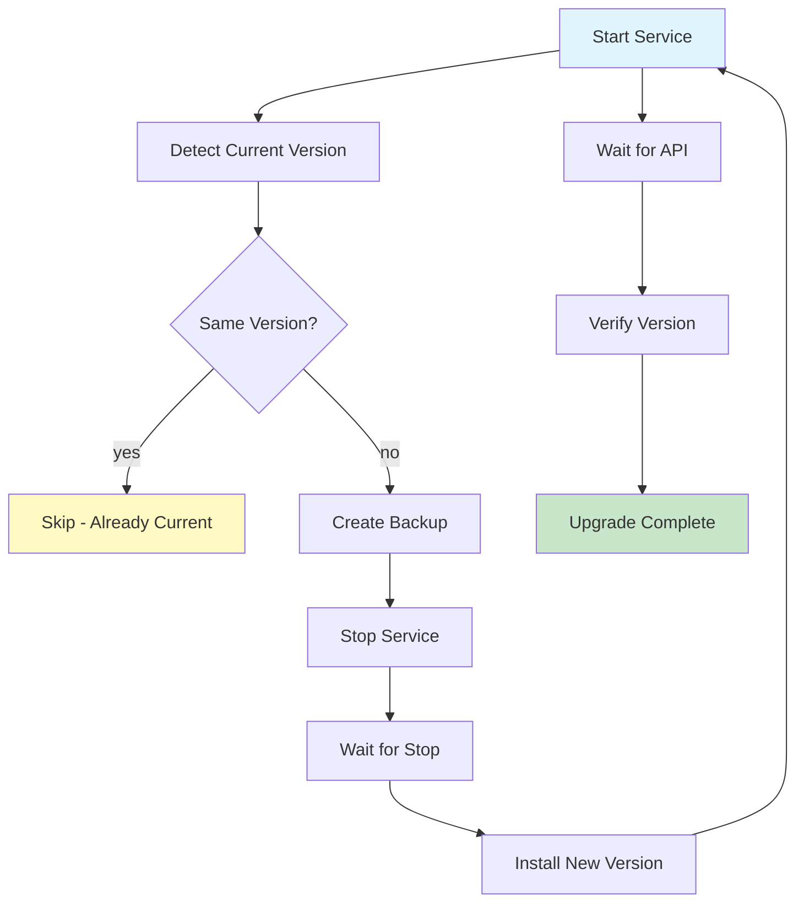

# Upgrade Guide

## Overview

Upgrade Nexus to a new version with automatic backup and verification.

## Upgrade Process



## Configuration

```yaml
nexus_version: "3.72.0"  # Target version

nexus_upgrade_backup_before: true
nexus_upgrade_rollback_on_failure: true
nexus_upgrade_skip_if_current: true
nexus_upgrade_verify_version: true
```

## Running Upgrade

```bash
# Upgrade to version in inventory
ansible-playbook -i inventories/production/inventory.yml playbooks/nexus_upgrade.yml

# Upgrade to specific version
ansible-playbook -i inventories/production/inventory.yml playbooks/nexus_upgrade.yml \
  -e "nexus_version=3.73.0"
```

## What Happens During Upgrade

| Step | Action | Duration |
|---|---|---|
| 1 | Detect current version | ~5s |
| 2 | Skip if same version | ~1s |
| 3 | Create backup | ~60s |
| 4 | Stop service | ~10s |
| 5 | Wait for stop | ~30s |
| 6 | Download new version | ~60s |
| 7 | Extract and install | ~30s |
| 8 | Start service | ~10s |
| 9 | Wait for API | ~120s |
| 10 | Verify version | ~5s |
| **Total** | | **~5-10 min** |

## Rollback

If upgrade fails:

```bash
# Restore from pre-upgrade backup
ansible-playbook -i inventories/production/inventory.yml playbooks/nexus_restore.yml \
  -e "nexus_restore_source=/var/nexus/backup/nexus-backup-<timestamp>.tar.gz"
```

## Version Compatibility

| From | To | Supported |
|---|---|---|
| 3.x | 3.x+1 | ✅ |
| 3.x | 3.x+2 | ✅ |
| 3.x | 4.x | Check docs |
| 3.x | 2.x | ❌ |

## Pre-Upgrade Checklist

- [ ] Backup enabled and tested
- [ ] Disk space available
- [ ] Maintenance window scheduled
- [ ] Clients notified
- [ ] Rollback plan documented
